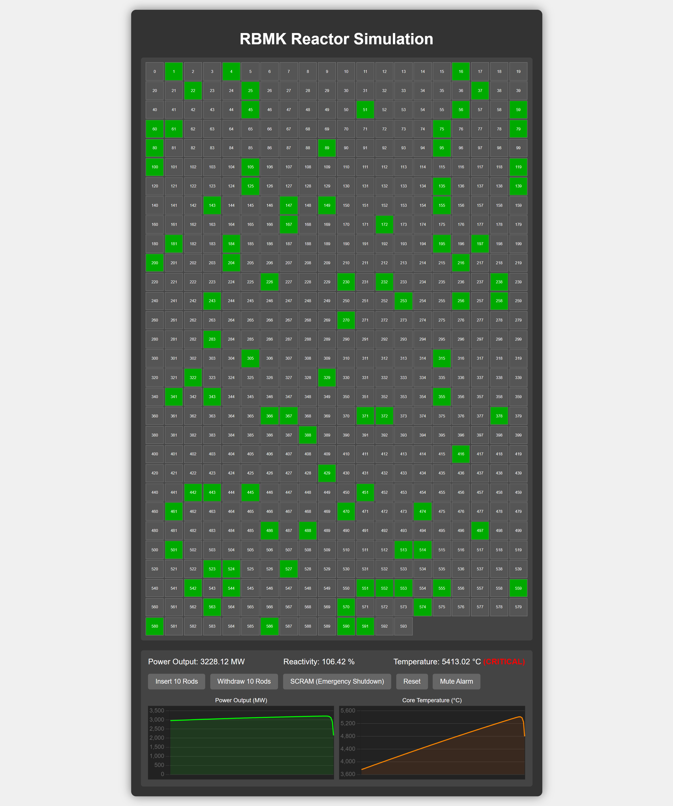

<h1> RBMK Reactor Simulation</h1>

This project simulates the behavior of a RBMK nuclear reactor core using <strong>HTML</strong>, <strong>CSS</strong>, and <strong>JavaScript</strong>. It features an interactive UI with control rods, real-time temperature and power graphs, and simplified reactor physics modeling.

<h2>Interactive Reactor Core</h2>
<ul>
  <li><strong>20 x 30 Grid (594 cells):</strong> Each cell represents a control rod or moderator.</li>
  <li><strong>Click</strong> cells to manually insert or withdraw individual rods.</li>
</ul>

<h2>Control Rod Colors</h2>
<ul>
  <li><strong>Gray:</strong> Idle rods (not inserted)</li>
  <li><strong>Red:</strong> Active rods (inserted) — reduce reactivity</li>
  <li><strong>Green:</strong> Moderators (non-removable) — increase neutron flux</li>
</ul>

<h2>Real-time Graphs</h2>
<ul>
  <li><strong>Power Output (MW):</strong> Green line chart</li>
  <li><strong>Core Temperature (°C):</strong> Orange line chart</li>
  <li>Both charts auto-update with recent data and resize with the window</li>
</ul>

<h2>Controls</h2>
<ul>
  <li><strong>Insert 10 Rods:</strong> Adds 10 idle rods (reduces reactivity)</li>
  <li><strong>Withdraw 10 Rods:</strong> Removes 10 active rods (increases reactivity)</li>
  <li><strong>SCRAM:</strong> Emergency shutdown — inserts all rods instantly</li>
  <li><strong>Reset:</strong> Resets all parameters and graphs to initial state</li>
</ul>

<h2>Status Display</h2>
<ul>
  <li><strong>Power Output:</strong> Live value in megawatts</li>
  <li><strong>Reactivity:</strong> % based on rods, voids, and xenon effects</li>
  <li><strong>Temperature:</strong> Core temp in °C with visual alerts:</li>
  <ul>
    <li>🔵 <strong>Normal</strong>: No label</li>
    <li>🟡 <strong>WARNING</strong>: Above 500 °C</li>
    <li>🔴 <strong>CRITICAL</strong>: Above 700 °C (blinking)</li>
  </ul>
</ul>

<h2>Reactor Physics (Simplified)</h2>
<ul>
  <li><strong>Positive Void Coefficient:</strong> Reactivity increases with temperature</li>
  <li><strong>Xenon Poisoning:</strong> Xenon-135 buildup decreases reactivity</li>
  <li><strong>Heat/Cooling:</strong> Power output generates heat, opposed by passive cooling</li>
</ul>
